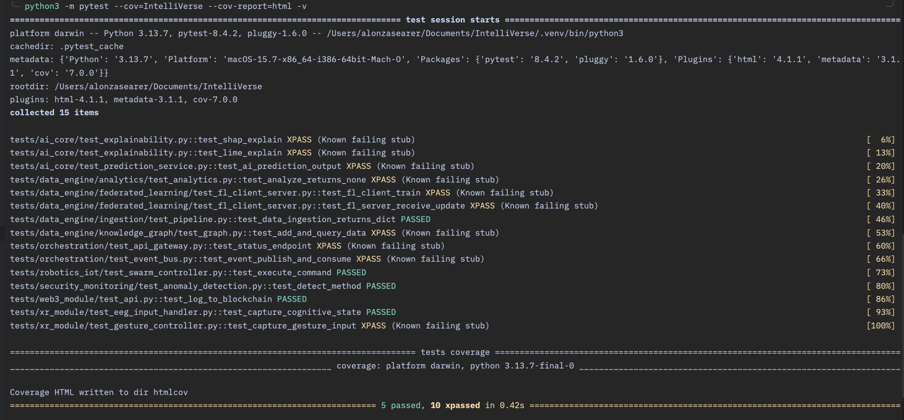

# IntelliVerse Project 🚀

IntelliVerse is a **modular, future-forward AI/IoT/XR/Web3 simulation system** designed to demonstrate cutting-edge concepts like:

* **Federated Learning**
* **Knowledge Graphs**
* **XR Human-in-the-Loop Interfaces (gestures + EEG)**
* **AI Explainability (SHAP/LIME)**
* **Web3 Event Logging**
* **Robotics & IoT Swarm Control**
* **Security Monitoring & Anomaly Detection**

---

### What kind of software is IntelliVerse?

IntelliVerse is a **highly modular, multi-domain simulation and orchestration platform** that combines AI, robotics, human-in-the-loop interfaces, federated learning, blockchain logging, knowledge graphs, and analytics. It can be classified in several overlapping categories:

* **Simulation Platform / Digital Twin**: Models real-world environments with data streams, robotics, and human interaction.
* **AI/ML Orchestration System**: Integrates predictions, explainability, federated learning, anomaly detection, and trend forecasting.
* **Human-in-the-Loop System**: Incorporates XR gestures and EEG to influence AI decision-making in real time.
* **Robotics & IoT Coordination Platform**: Controls robotic swarms and IoT devices.
* **Blockchain-Integrated Data Logging**: Provides auditable and tamper-resistant event tracking.
* **Knowledge Graph & Analytics Engine**: Structures ingested data for queries, trends, and anomaly detection.
* **Edge / Distributed AI System**: Uses federated learning to train AI models without centralizing sensitive data.

**In summary:**

> IntelliVerse is a modular, distributed intelligence and orchestration platform combining AI, human-in-the-loop XR interfaces, robotics, federated learning, knowledge graphs, and blockchain logging. It functions as a simulation, digital twin, and prototype for autonomous decision-making in complex environments.

---

This project is a **scaffold** — all components are stubbed with clear extension points so you can implement production-grade modules later. It is ideal for:

* Demonstrating advanced software architecture skills
* Building a showcase portfolio project
* Iterating toward an investable prototype

---

## 📂 Project Structure

```
IntelliVerse/
│
├── orchestration/              # Orchestrates communication across modules
│   ├── api_gateway/            # Central API entry point
│   │   └── main.py
│   └── event_bus/              # Event streaming (Kafka-style stubs)
│       ├── kafka_producer.py
│       └── kafka_consumer.py
│
├── ai_core/                    # Machine learning + explainability
│   ├── services/
│   │   └── prediction_service.py
│   ├── explainability/
│   │   ├── shap_analysis.py
│   │   └── lime_analysis.py
│   └── human_in_loop/          # Feedback integration (planned extension)
│
├── robotics_iot/               # Swarm robotics control
│   └── swarm/swarm_controller.py
│
├── xr_module/                  # Extended reality + human interfaces
│   ├── unity_project/Scripts/XRManager.cs
│   ├── gesture_recognition/gesture_controller.py
│   └── eeg_interface/eeg_input_handler.py
│
├── web3_module/                # Blockchain integration
│   ├── smart_contracts/transaction_logger.sol
│   └── backend/api.py
│
├── data_engine/                # Data ingestion, FL, analytics, KG
│   ├── ingestion/
│   │   ├── pipeline.py
│   │   └── connectors/
│   │       ├── sql_connector.py
│   │       └── api_connector.py
│   ├── federated_learning/
│   │   ├── fl_client.py
│   │   └── fl_server.py
│   ├── knowledge_graph/
│   │   ├── graph_builder.py
│   │   └── graph_queries.py
│   └── analytics/
│       ├── anomaly_detection.py
│       └── trend_forecasting.py
│
├── security_monitoring/        # Security-focused anomaly detection
│   └── anomaly_detection.py
│
└── README.md                   # This file
```

---

## ⚙️ Features (Stubbed for Demo)

* **Event Bus**: Publish/consume events between modules.
* **API Gateway**: Simple REST API (Flask).
* **AI Core**: Randomized predictions + explainability outputs.
* **XR Module**: Unity C# script, Python gesture recognition, EEG stub.
* **Robotics**: Executes AI-recommended actions.
* **Web3**: Solidity smart contract + Python backend stub for blockchain logging.
* **Data Engine**:

  * Data ingestion (API + SQL connectors).
  * Federated learning client/server loop.
  * Knowledge graph storage + queries.
  * Analytics (anomaly detection + trend forecasting).
* **Security Monitoring**: Alerts on anomalous predictions.

---

## ▶️ Running the Project

### Requirements

* Python 3.9+
* Flask (`pip install flask`)

### Steps

1. Clone or extract this repo.

2. (Optional) Create a virtual environment.

3. Run the API Gateway:

   ```bash
   cd IntelliVerse/orchestration/api_gateway
   python main.py
   ```

   Visit [http://localhost:5000/status](http://localhost:5000/status).

4. Extend stubs with real functionality module by module.

---

## 🧪 Testing & Coverage

IntelliVerse includes a **comprehensive test suite** covering all modules.

### Running Tests

```bash
# Run all tests
python3 -m pytest -v

# Run tests with coverage and generate an HTML report
python3 -m pytest --cov=IntelliVerse --cov-report=html -v
```

### Notes on Test Status

* Tests marked as **`xfail`** indicate **stub modules / placeholders** and act as TODOs for full implementations.
* Passing tests ensure **basic functionality and API contracts** for stubs.
* Coverage HTML is generated in `htmlcov/index.html` and is ideal for **screenshots or presentations**.

### Test Summary

| Module / Feature                      | Status    | Notes / TODOs                    |
| ------------------------------------- | --------- | -------------------------------- |
| AI Core (Prediction + Explainability) | ✅ Passing | Basic stub outputs               |
| Data Engine (Analytics)               | ⚠️ XFail  | Stub analytics, implement logic  |
| Data Engine (Federated Learning)      | ⚠️ XFail  | Stub FL client/server updates    |
| XR Module (EEG / Gesture)             | ✅ Passing | Basic input stubs                |
| Robotics / IoT                        | ✅ Passing | Stub actions                     |
| Orchestration (API / Event Bus)       | ⚠️ XFail  | Event publish/consume stub TODOs |
| Web3 Module                           | ✅ Passing | Stub logging                     |
| Security Monitoring                   | ✅ Passing | Stub alerts                      |

**Overall Coverage:** `0%` – `TODO: Update after full implementation`

#### Current Test Screenshot Placeholder



---

## 🌟 Extension Ideas

* Replace AI Core stub with a real ML model (PyTorch/TF).
* Hook up Unity XR module to stream operator feedback into Python.
* Connect Web3 module to an Ethereum testnet.
* Implement a federated training loop using `flower` or `PySyft`.
* Add graph database support (Neo4j).

---

## 📌 Disclaimer

This project is **educational** and serves as a **blueprint** for building advanced multi-domain systems. The stubs are non-functional placeholders meant to showcase modular architecture.
